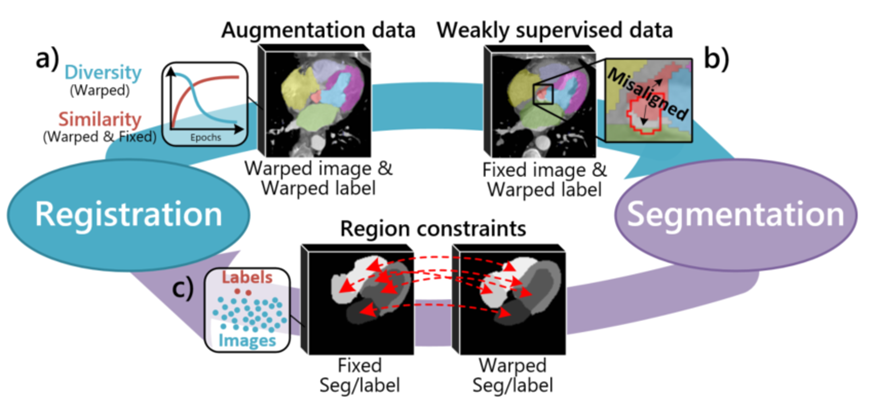
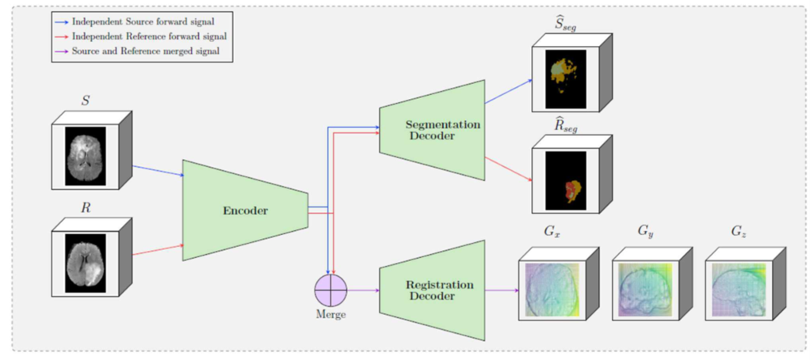

## 目录

[TOC]

### 19. DeepAtlas: Joint Semi-supervised Learning of Image Registration and Segmentation (2019 MICCAI)

1. 动机

   ​        图像分割和配准可以相互促进，配准为分割提供了数据增强，分割为配准提供了额外的监督信息并用于评估配准结果。传统的联合分割和配准的方法对单个图像对进行操作而不是图像的总体，并且计算代价高。此外，获得 3D 医学图像的分割标签是困难的和劳动密集型的。因此，大部分 3D 图像数据都没有标签用于有监督学习。针对这样的情况，作者提出了 DeepAtlas，联合学习深度网络进行弱监督配准和半监督分割，贡献如下：

   - 第一个提出了联合学习两个深度神经网络进行图像配准和分割。DeepAtlas 既可以联合训练，也可以单独训练和预测。
   - DeepAtlas 只需要少量的人工分割标签，使用结构相似性损失来相互指导分割和配准。
   - 在极端情况下，如果只有一个手动分割的图像可用，DeepAtlas 有助于 one-shot 分割，同时提高配准性能。

2. 方法

   

   

   ​        弱监督配准学习（蓝色实线部分）：图像相似性损失$L_i$ , 正则化损失$L_r$ 和解剖相似性损失（即分割标签的Dice损失）$L_a$的加权相加来训练配准网络。

   ​		半监督分割学习（黄色虚线部分）：有监督分割损失$L_{sp}$和解剖相似性损失（通过配准网络扭曲的$I_m$的分割标签和$I_f$的分割标签的Dice损失）$L_a$的加权相加来训练分割网络，损失函数定义如下：
   $$
   L_{seg}=\left \{ \begin{matrix} \lambda_aL_a(S_m\circ\Phi^{-1},F_S(I_t))+\lambda_{sp} L_{sp}(F_S(I_m),S_m),&&&if\ I_t\  is\ unlabeled\ ;  \\ \lambda_aL_a(F_S(I_m)\circ\Phi^{-1},S_t)+\lambda_{sp} L_{sp}(F_S(I_t),S_t),&&&if\ I_m\  is\ unlabeled\ ;\\ \lambda_aL_a(S_m\circ\Phi^{-1},S_t)+\lambda_{sp} L_{sp}(F_S(I_m),S_m),&&&if\ I_t\ and\ I_t \ are\ labeled\ ; \\ 0\ , if\ both\ I_t\ and \ I_m\ are\ unlabeled \ . \end{matrix}\right. \tag{1}
   $$
   当$I_t$没有手动分割标签时，$L_a$相当于有监督分割损失，其中$S_m\circ\Phi^{-1}$是噪声标签。当$I_m$没有手动分割标签时，通过分割网络获得标签，然后扭曲这个标签并与$S_t$计算Dice损失。当$I_t$和$I_m$都有标签时，$L_a$不监督分割网络，因为此时$L_a$中没有$F_s$，但会监督配准网络。当$I_t$和$I_m$都没有标签时，不训练分割网络。总的来说，$I_m$和$I_t$谁没有手动分割标签，谁就通过分割网络来生成伪标签然后用于半监督训练，最少也要有一个手动分割标签。

   ​         训练时，交替训练两个网络中的一个，同时保持另一个固定。由于分割网络收敛更快，分割和配准网络交替训练步数为 1 : 20。由于从零开始联合训练是很困难的，所以作者首先分别对单个分割、配准网络进行预训练。当真实标签数量极少时，比如只有一个，那么从零开始单独训练分割网络是很难的，所以作者最先使用无监督预训练好配准网络，然后再使用这个配准网络从头训练分割网络。直到分割网络能得到合理的结果后，才开始联合训练（交替训练）。

3. 总结

   ​        作者提出了 DeepAtlas 框架，用于仅使用少量标注图像的分割和配准网络的联合学习。当只给出一个真实分割标签时，作者的方法提供了 one-shot 分割学习，大大提高了配准效果。这表明，一个网络可以受益于对另一个网络提供的无标签数据的不完善监督。DeepAtlas 为训练分割和配准网络时缺少真实分割标签提供了一个通用的解决方案。对于未来的工作，为分割和配准网络引入不确定性措施可能有助于缓解一个网络的不良预测对另一个网络的影响。研究通过层共享的分割和注册网络的多任务学习也将是有益的。这可能会进一步提高性能并减小模型尺寸。

4. 问题

   ​         在实验部分，作者考虑 one-shot 的情况（N = 1，N表示手动分割标签的数量），设计了 Semi-DeepAtlas（Semi-DA）：固定无监督（N = 0）预训练好的配准模型，用于从零训练分割网络（N = 1）。使用Semi-DA分割网络和无监督配准网络初始化DA模型。似乎N=1的时候不足以训练好一个分割网络？没有理解它的one-shot分割过程。

   

### 20. A Cross-Stitch Architecture for Joint Registration and Segmentation in Adaptive Radiotherapy （2020 PMLR）

1. 动机

   ​        医学图像自动轮廓化的两种常用方法是图像分割和基于配准的轮廓传播。在自适应图像引导放射治疗的背景下，基于配准的方法具有使用患者解剖结构的先验知识的优势，并且能够准确deform低对比度结构，这些结构难以用附近高对比度结构进行识别。图像分割有其自身的优势，最显著的是能够准确地勾画出器官的轮廓，这些器官在两次访问之间的形状变化很大。

   ​        为了充分利用这两种方法的独特优势，提出了联合配准与分割（JRS）方法。在这项工作中，作者使用多任务学习领域的概念，通过在架构级合并这两个任务来进一步连接配准和分割，而不仅仅是通过损失函数。

2. 方法

   

   ​       

   ​       作者提出的方法如上图所示。JRS输入固定图像$I_f$，移动图像$I_m$，和$I_m$的分割标签$S_m$。 JRS输出$S_f^{pred}$，并与真实标签$S_f$计算Dice loss；输出形变场$\Phi^{pred}$，并计算它的Bending Energy（$\Phi^{pred}$的二阶导数，即Hessian矩阵）作为正则化loss；用$\Phi^{pred}$扭曲$I_m$得到$I_m^{warped}$, 并与$I_f$计算NCC loss；用$\Phi^{pred}$扭曲$S_m$得到$S_m^{warped}$, 并与$S_f$计算NCC loss，这几部分loss加权相加作为总的loss。图中S表示分割层（一个或多个卷积组成的模块），R表示配准层。Cross-Stitch单元是这些层交换信息的模块[1]。Cross-Stitch的计算过程如下：给定分割网络S第$l$层的第$k$个卷积核得到的特征图$X_S^{l,k}$，配准网络R第$l$层的第$k$个卷积核得到的特征图$X_R^{l,k}$，和四个可学习的参数$\alpha_{SS}^{l,k},\alpha_{SR}^{l,k},\alpha_{RS}^{l,k}$和$\alpha_{RR}^{l,k}$，Cross-Stitch单元计算得到的特征图为：
   $$
   \left[
    \begin{matrix}
   	\hat{X}_S^{l,k}\\
   	\hat{X}_R^{l,k}
     \end{matrix}
     \right]=\left[
    \begin{matrix}
   	\alpha_{SS}^{l,k},\alpha_{SR}^{l,k}\\
   	\alpha_{RS}^{l,k},\alpha_{RR}^{l,k}
     \end{matrix}
     \right]\left[
    \begin{matrix}
   	X_S^{l,k}\\
   	X_R^{l,k}
     \end{matrix}
     \right] \tag{1}
   $$
   Cross-Stitch的优点是能够学习在任务之间强烈共享特征映射，如果这是有益的。相反，如果特征映射对完全独立更好，网络可以学习单位矩阵来分离这些特征映射。这允许以一种灵活的方式在两个路径之间共享表示，在参数数量方面的成本可以忽略不计。

   

   [1] Misra I, Shrivastava A, Gupta A, et al. Cross-stitch networks for multi-task learning[C]//Proceedings of the IEEE conference on Computer Vision and Pattern Recognition (CVPR). 2016: 3994-4003

3. 总结

   ​       在这项工作中，作者提出了从架构上连接图像配准和分割，以生成对自适应图像引导放疗至关重要的日常器官勾画。作者尝试了在三维全卷积神经网络中交织配准和分割的不同方法，发现用Cross-Stitch单元连接任务效果最好。通过Cross-Stitch单元，网络学习在其配准路径和分割路径之间交换信息。未来研究的一个有希望的方向是研究在联合网络中添加第三个任务，特别是放射治疗计划的生成。这可能使联合网络产生具有良好剂量学的特征。进一步的研究可能是针对不同患者群体和扫描仪的网络泛化。

4. 问题

   无

### 21. A Hybrid Deep Learning Framework for Integrated Segmentation and Registration: Evaluation on Longitudinal White Matter Tract Changes (2019 MICCAI)

1. 动机

   ​       在纵向成像研究中，可以使用针对纵向数据定制的方法来提高分割的一致性。现有的解决方案通常涉及独立的配准和分割组件，这些组件在多级管道中按顺序或迭代地执行。利用可变形配准建立的空间对应关系，既可用来引入先验值在后续时间点进行分割，也可用来在公共空间中进行分割。作者在这里提出了一种新的混合卷积神经网络，它可以在单一过程中优化分割和配准。

2. 方法

   

   ​         配准和分割共用一个网络。Hybrid CNN为U-Net。

3. 总结

   无

4. 问题

   无

### 22. A segmentation-informed deep learning framework to register dynamic two-dimensional magnetic resonance images of the vocal tract during speech (2022 BSPC)

1. 动机

   ​        动态磁共振(MR)成像可以在讲话过程中可视化发音器。在声道的二维MR图像中量化发音器运动的兴趣越来越大，以更好地理解语音产生，并可能为患者的管理决策提供信息。一些研究使用传统的变形配准方法来估计语音过程中声道的一系列动态2D MR图像中图像之间的位移场，然而，这些研究都没有评估或讨论配准方法是否捕捉到了舌头和软腭接触的变化。这项工作包括两个贡献。首先，它提出了基于分割的深度学习的可变形配准框架，以优化其在语音过程中估计声道动态2D MR图像之间的位移场。其次，这项工作首次使用了基于关节运动（腭咽闭合）的可量化和临床相关方面的度量来评估这些位移场的准确性。

2. 方法

   

   ​        首先，图像对被用作分割网络的输入，分割网络估计图像中六个不同解剖特征的分割。其次，对分割进行后处理，以去除解剖学上不可能的区域（论文中没有细讲）。第三，将图像对和后处理分割用作配准网络的输入，该配准CNN估计位移场以使运动图像与固定图像对齐。第四，将运动图像和位移场作为空间变换器的输入，对运动图像进行变换。在训练和评估过程中，还使用空间变换器对运动图像的ground-truth (GT)分割进行变换。损失函数包括移动图像和固定图像的相似度损失、形变场正则化损失和分割标签的Dice损失。

3. 总结

   ​         作者开发了一种用于估计语音过程中声道动态2D MR图像之间位移场的框架，并发现该框架比目前五种最先进的可变形配准方法和框架更准确地捕捉发音器运动的各个方面。该框架是朝着这类图像系列中关节运动的全自动量化的最终目标迈出的一步。此外，提出了一种基于发音器运动的临床相关和可量化方面的度量标准，并表明这对于评估语音动态MRI图像的注册框架是有用的。

4. 问题

   无

### 23. Deep Complementary Joint Model for Complex Scene Registration and Few-Shot Segmentation on Medical Images (2020 ECCV)

1. 动机

   

   ​        配准与分割任务具有很强的互补性，在复杂场景和few shot情况下可以相互促进。如上图所示，配准模型在训练过程中为分割模型提供了不同的增强数据（扭曲的图像和标签）或弱监督数据（固定图像和扭曲的标签），从而减少了标签的要求，增强了few shot情况下的分割泛化能力。分割模型对区域约束进行反馈，从而在复杂场景中更加关注感兴趣区域（ROI），实现更精细的配准。**上图中的label应该是移动图像的label，此论文中固定图像应该没有ground true label。**

   ​        然而，由于以下原因，这种互补拓扑的进一步利用受到阻碍：

   - Limitation 1：数据增强能力下降（上图（a））。配准模型在训练过程中，学习匹配真实情况的变形规则，生成不同的扭曲图像作为增强数据，提高分割泛化能力。然而，扭曲图像与固定图像之间的相似度增加并趋于稳定，随着相似度的稳定，扭曲图像的多样性逐渐减少。因此，在配准网络的后期训练阶段，在不同的epoch生成相同的扭曲图像，导致增强数据多样性降低。因此配准模型的数据增强能力下降，限制了分割的进一步增强。
   - Limitation 2：弱监督数据中的错位区域（上图（b））。弱监督数据扩大了标记数据集，并为分割模型提供了额外的监督信息。但是，这些数据中较大的错位区域会产生不正确的优化目标，如果直接使用会扰乱训练过程，导致严重的误分割。
   - Limitation 3：缺乏基于标签的区域约束（上图（c））。然而，在few-shot环境下，由于标签较少，缺乏基于标签的区域约束。因此在复杂场景下，配准模型会进行粗糙优化，复杂的背景会限制在ROI上的配准性能。

   ​       针对这三个问题，作者提出了三个解决方案（第2节叙述）。本文提出了一种深度互补联合模型（Deep Complementary Joint Model, DeepRS），该模型最小化复杂场景下的背景干扰，以实现对ROI的更精细配准，并大大降低了少镜头情况下分割的标签要求，以获得更高的泛化能力。

2. 方法

   

   Solution 1: Deep Structure Sampling (DSS) for Sustainable Data Augmentation. 

   

   ​        DSS块通过在变形场中嵌入随机扰动因子，持续生成不同的增强数据，以增加扭曲图像和标签的不确定性。配准过程是图像结构信息的位移，而形变程度的扰动实现了对该位移路径上的信息采样。因此，DSS块带来两个优势：1）可持续的数据增强。通过扰动因子控制配准网络的变形程度，保证配准网络能够持续生成多样化的增强数据。2）真实分布。从位移路径中提取结构信息，得到的增强数据比其他人工增强方法更符合实际分布。上图 a）对形变场$\phi$乘以从均匀分布中采样得到的扰动因子$\alpha$, 得到采样后的形变场$\hat{\phi}$。因此，即使配准网络已经融合，被它扭曲的图像和变形的标签仍然会有很大的多样性。从图 b）可以看出，随着α的增大，由于其结构信息接近于固定图像，扭曲图像逐渐接近于固定图像。

   Solution 2: Alignment Confidence Map (ACM) for Supervision Information Utilization.

   ​       基于Patch-GAN的像素级鉴别器学习扭曲图像和固定图像之间的相似性，并输出突出显示对齐区域的对齐置信度图。因此，在计算弱监督损失函数时，通过这些对齐置信度图可以抑制不对齐的区域，并利用对齐区域中的监督信息进行更高的分割泛化，如式（1）所示
   $$
   L_{acm}=-D(W(x_m,\hat{\phi}))\ W(y_m,\hat{\phi})\ logS(x_f) \tag{1}
   $$
   其中，$x_m,y_m,x_f$和$\hat{\phi}$ 分别表示移动图像、移动图像的标签、固定图像和采样的形变场。 $D(\cdot,\cdot)$表示计算两个图像直接的相似度，$W(\cdot,\cdot)$表示扭曲操作。$D(\cdot,\cdot)$计算得到的应该还是一个矩阵，表示对应位置的像素的相似度。$S(x_f)$应该是分割网络输出的软分类标签。$W(y_m,\hat{\phi})和$$S(x_f)$重合（对齐）的区域权重大，对应的相似度损失就越大，误差区域的损失值将得到较低的权重，从而抑制干扰。由于$y_m$是0,1二值化的，不重合的部分权重应该是为0。**这个公式中似乎没有对齐置信度图，即图中的绿色箭头。而且，Limitation 2说的应该是固定图像和扭曲得到的标签的不对齐问题，但这里解决的是输入到配准网络的扭曲标签和分割后的标签不对齐的问题？**

   Solution 3:  Deep-Based Region Constraint (DRC) for Finer Registration on ROIs.

   ​        DRC策略通过来自分割网络的固定和扭曲分割掩码之间的约束（公式（2））来引导注意力在ROI上进行更精细的配准。该深度区域约束以变形图像和固定图像中对应区域的对齐为优化目标，实现了 1）在少镜头情况下释放基于标签的区域约束的标签要求，2）独立优化不同区域以避免相互之间的不对齐，3）在ROI上额外关注区域以实现更精细的配准。
   $$
   L_{drc}=-(S(W(x_m,\hat{\phi}))-S(x_f))^2 \tag{2}
   $$
   即分别在分割网络中输入扭曲的固定图像和固定图像，输出两个分割图像，计算它们的MSE。每个ROI在不同通道中计算，得到独立的精细优化，**而任务不相关区域在一个后台通道中计算（不理解）**。因此，ROI上的精细配准是可用的，并避免了区域间的错误配准。

   ​       DeepRS模型中的配准网络、分割网络和像素级鉴别器通过不同的损失函数组合进行训练，以协调训练过程，实现相互改进。配准网络的损失函数为：
   $$
   L_{reg}=\lambda_{adv}L_{adv}+\lambda_{drc}L_{drc}+\lambda_{cc}L_{cc}+\lambda_RL_{R} \tag{3}
   $$
   其中，像素级鉴别器的对抗损失$L_{adv}$提供了扭曲图像和固定图像之间的相似度度量，分割网络中DRC的损失引起了对ROI的配准关注，$L_{cc}$表示局部互相关损失，$L_R$表示形变场的正则化损失。分割网络的损失函数$L_{seg}$由两部分组成：
   $$
   L_{seg}=\lambda_{acm}L_{acm}+\lambda_{ce}L_{ce} \tag{4}
   $$
   ACM损失$L_{acm}$将弱监督数据加入到训练中，以获得更高的分割泛化能力，扭曲标签和扭曲图像通过分割网络得到的标签之间的交叉熵损失$L_{ce}$来保持正确的优化目标。鉴别器由参考图像$x_r$和固定图像$x_f$组成的配准图像对作为阳性情况，由扭曲图像$x_w$和固定图像$x_f$组成的图像对作为阴性情况。参考图像$x_r$是运动图像$x_m$和固定图像$x_f$的融合，$x_r=\beta*x_m+(1-\beta*x_f)$。鉴别器的损失除了$L_{adv}$外，还有鉴别真假固定图像的损失$L_D$
   $$
   L_D=-log(D(x_r,x_f))-log(1-D(x_w,x_f)) \tag{5}
   $$

3. 总结

   ​       本文提出了一种用于复杂场景配准和少镜头分割的深度互补联合模型（DeepRS）。本文提出的DSS块通过扰动因子随机调整变形场，从而提高了扭曲图像和标签的活性，实现了可持续的数据增强能力；提出的ACM方法通过像素级鉴别器的对齐置信度映射有效地利用弱监督数据中的监督信息，带来更高的分割泛化；提出的DRC策略从分割模型中构建了扭曲和固定图像之间的无标签损失，从而在ROI上实现更精细的配准。本文的工作大大降低了对大型标记数据集的要求，并提供了精细的优化目标，从而提高了配准和分割精度，大大节省了成本。特别是，我们的DeepRS模型在一些标记困难、场景复杂或数据集小的情况下具有很大的潜力。

4. 问题

   第2节加粗部分。

### 24. Deep Learning-Based Concurrent Brain Registration and Tumor Segmentation (2019 Frontiers in Computational Neuroscience)

1. 方法

   ​        本文中，我们提出了一种基于双重深度学习的架构，同时解决配准和肿瘤分割问题，放松了预测肿瘤区域内的配准约束，同时提供位移场和分割图像。

   

​                 共享编码器，分离解码器结构。

### 25. Image-and-Spatial Transformer Networks for Structure-Guided Image Registration (2019 MICCAI)

1. 动机

   ​        作者认为到目前为止，基于神经网络的图像配准并没有充分利用深度表示学习。同时观察到，无论监督方法还是无监督方法都没有利用神经网络的两个关键优势，即 1）学习为下游任务优化的新表示的能力，以及 2）在训练期间incorporate额外的信息并从中受益的能力，但是这些信息在测试时不可用或很难获得。这种额外的监督（如分割标签和landmark等）可以帮助在测试时以不同于单独使用图像强度的方式指导配准。例如，配准可能专注于特定的Structures-of-Interest (SoI)。然而，目前的方法不能保留或显式提取这些额外的信息，因此不能在测试时进一步使用。

   ​        为了克服这些限制，并充分利用神经网络学习表示的关键能力，引入了图像和空间转换网络（ISTN），其中添加了专用的图像转换网络（ITN）到空间转换网络（STN）的头部，旨在提取和保留有关SoI的信息。ITN产生一种新的图像表示，该图像表示以端到端方式学习，并针对下游配准任务进行优化。这不仅允许我们在测试时预测良好的初始转换，而且允许使用完全相同的模型进行精确的特定于测试的迭代细化，从而实现结构引导配准。

2. 方法

   ​        STN是大多数基于DL的图像配准网络的构建块。STN有两个主要组成部分：使用卷积层学习输入的新表示的特征提取部分，以及将这些表示映射到转换参数的第二部分。然而，STN可以学习的表示形式并不是公开的，而是在推理过程中保持隐藏（可能是指无法直观理解到这些表示的所代表的含义）。作者通过引入专用的图像转换网络，重新设计了基于图像配准的神经网络转换模块的基本构建模块。

   

   

   ​      作者将ITN定义为卷积神经网络，将输入图像映射到与$S_M$和$S_F$有相同大小和维度的输出图像$M'$和$F'$。$S_M$和$S_F$分别是固定图像和移动图像的监督信息（如分割图像或landmark等）。然后将$M'$和$F'$输入到STN网络中，输出变换参数$\theta$。图中虚线框里面有两幅图像，$F$, $M$和$S$分别表示固定图像、移动图像和监督图像，下标$\theta$表示对图像进行变换，$L$表示对应两幅图像的相似性损失。有explict和implicit两个损失组合策略，对应的损失项如上图所示。总的来说ITN的作用就是将输入图像变成相应的监督图像，如果监督信息是分割图像，那么ITN就是分割网络，如下图所示，第一行逐渐输出分割标签，第二行逐渐输出landmark。

   

3. 总结

   ​       ISTN是一种基于神经网络的结构引导图像配准的通用框架，使用学习表示进行特定测试的细化。在SoI信息包含噪声的情况下，隐式学习表示可能有助于防止过拟合。

4. 问题

   ​       作者说ITN的作用是显式地公开学习的图像表示，这对于STN解决的下游配准任务是最优的。但我感觉输入的$M'$和$F'$只包含有监督的那部分信息，似乎不足以产生能够对原始图像进行良好变换的参数。

### 26. Joint few-shot registration and segmentation self-training of 3D  medical images (2022 BSPC)

1. 动机

   ​        在一些联合配准和分割的方法中，当分割用于弱监督配准时，分割伪标签的质量往往被忽略。当使用配准进行分割时，不考虑配准变形对输入的噪声影响。而未标记的数据通常被排除在损失计算之外。其他方法通常需要大量标记数据进行监督训练。

   ​        为了这些局限性，作者提出了一种联合配准和分割自训练框架（JRSS），该框架使用伪标签为分割和配准提供额外的监督学习。要点如下：1）JRSS允许双任务在循环迭代中相互学习和促进，共同提高了3D医学图像在few-shot场景下的多器官分割和变形配准双任务性能。2）JRSS集成了注入噪声、阈值筛选和不确定性估计等多种校正方法，保证了伪标签由粗到细的正向优化。3）质量评估和筛选伪标签促进弱监督配准的学习，配准的数据变形作为输入噪声和数据增强。4）JRSS通过联合自训练逐步增加分割和配准的弱监督训练，实现分割和配准的联合学习和知识互补。

2. Related Work摘要

   ​        基于DL的伪标记策略为标签稀缺的医学图像任务提供了一种利用无标记数据增强模型性能的重要方法。在医学图像配准和分割的双重任务中，分割（伪）标签为与图像强度无关的配准学习提供了额外的弱监督约束。配准在本质上可以为分割提供比随机翻转、缩放和仿射变形更合理的数据增强方案。此外，作者将变形图像视为一种输入噪声。

   ​        最近的联合配准和分割学习（joint registration and segmentation learning, JRS）方法取得了显著的效果。一方面，利用无监督配准或域自适应，将部分标记数据与无标记数据对齐，生成新的符合目标集结构特征的标记训练集，该训练集可以被完全监督进行分割或配准学习。这些方法利用配准进行标签传播，显示了在JRS学习中使用配准进行数据增强的优点。另一方面，使用分割标签可以使配准网络额外关注ROI，约束网络优化，实现更精细的配准。

   ​        作者的JRSS使用了类似[DeepAtlas](19. DeepAtlas: Joint Semi-supervised Learning of Image Registration and Segmentation (2019 MICCAI))， [DeepRS](23. Deep Complementary Joint Model for Complex Scene Registration and Few-Shot Segmentation on Medical Images (2020 ECCV))和RSegNet的模型架构。它们通过联合损失函数和分割伪标签研究了半监督分段和弱监督配准的相互帮助，展示了分割和配准联合学习的优势。而DeepAtlas的分割网络在输入无标签数据时，将Dice loss设为0，这意味着无标签数据不会参与分割网络的优化。DeepRS利用基于GAN的对齐置信度图来测量配准，为弱监督分割提供加权损失。但是，变形场容易受到背景标签的干扰，导致变形失真。RSegNet需要对标记数据进行完全监督的训练，以确保伪标签有利于注册，未标记的数据将不参与训练。另一种JRS方法，[Cross-Stitch](20. A Cross-Stitch Architecture for Joint Registration and Segmentation in Adaptive Radiotherapy （2020 PMLR）)使用名为Cross-Stitch的单元在架构级融合分割和注册的双重任务，但也需要依赖于带有标记数据的监督训练。作者的JRSS采用配准和分割的联合自训练策略，通过伪标签构建双任务的知识桥梁，多种校正方法确保伪标签的良性循环，克服了上述JRS方法的局限性。

   ​        使用伪标签的半监督分割自训练取得了很好的效果，但是模型生成的伪标签仍然会包含有噪声的预测，因此筛选伪标签是一个必不可少的过程，以避免质量较差的伪标签影响模型的迭代训练。JRSS结合了最近的SOTA半监督自训练框架来筛选伪标签，以确保分割网络被很好地学习。

3. 方法

   

   分割：

   （1）预训练教师网络：第一步用有标签数据预训练教师分割网络，用soft multi-class Dice loss 解决类别不平衡问题。

   （2）伪标签筛选：用训练好的教师分割网络给无标签数据生成软伪标签（不同类别的概率分布），用给定的阈值$\tau$筛选伪标签，将剩下的软伪标签转化为硬伪标签。

   （3）伪标签学习的自动校正：将有标签的数据和伪标签数据混合成新的训练集，在这个训练集上训练学生分割网络，训练时给输入图像加入噪声（dropout）。当使用dropout作为模型噪声时，学生网络被迫模仿一个更强大的集成模型，这保证了自训练中的分割网络会不断进步。此外，对于无标签数据，用预训练得到的配准网络对移动图像进行扭曲可以作为一种输入噪声（相当于给固定图像加入噪声）。损失函数包括$L_c$,$L_u$和$L_d$三部分，$L_c$计算了分割输出和标签（包括真实标签和伪标签）的交叉熵；$L_u$计算了学生网络和教师网络输出的KL散度，在教师模型和学生模型的两个softmax预测之间进行不确定性估计，**以纠正在学生网络学习时的伪标签干扰？**

   （4）迭代训练：将学生网络权重的指数移动平均（EMA）作为新的教师分割模型的权重，回到步骤（2）。

   配准：

   ​         对于没有分割标签的图像，使用带有（伪）标签数据的新训练集为配准网络提供弱监督训练。损失函数包括图像相似性损失$L_i$, 正则化损失$L_r$和扭曲的移动标签与固定标签的Dice损失$L_d$。

4. 总结

   ​       本文提出了一种联合配准和分割自训练框架JRSS，以提高人工注释较少的场景下医学图像配准和分割的双任务性能。通过伪标签的噪声注入和不确定性校正，确保分割网络在自我训练过程中迭代优化。由粗到细训练的分割网络为无标签数据预测出更多符合条件的伪标签，因此基于无监督配准学习，可将无标签数据及其伪标签作为弱监督配准约束加入。配准提供的数据扭曲为分割自训练注入了输入噪声，提供了更合理的数据增强。在未来的工作中，条件图像配准方法结合自监督学习范式可自动搜索最优解。多模态双任务学习也可以通过联合自我训练与对抗性学习域适应相结合进行研究，这可能进一步减少对标记数据的依赖。

5. 问题

   第3节加粗部分。分割和配准如何一起训练好像没有讲。

### 27. Joint Learning of Motion Estimation and Segmentation for Cardiac MR Image Sequences (2018 MICCAI)

1. 动机

   ​       大多数方法认为分割和运动估计是两个独立的问题。然而，这两个任务是密切相关的，学习一个问题的有意义的表示应该有助于学习另一个问题的表示。本文提出了一种联合深度学习网络，用于同时预测心脏MR序列的分割和运动估计。

2. 方法

   

   ​        输入$t$到$t+T$时刻的图像，将$t+1$到$t+T$时刻的源帧图像配准到$t$时刻的目标帧图像。分割网络和配准网络的编码器相同。编码器提取多尺度特征，通过上采样返回原始分辨率并将这些特征图拼接到一起。为了利用连续帧的信息，同时保证估计运动场的时空平滑性，使用了一个简单的RNN，沿着时间维度传播运动信息。通过最小化转换后的帧和目标帧之间的像素均方误差来优化网络。为了保证局部的平滑，使用Huber损失的近似来惩罚流图的梯度。形变场扭曲源帧的分割图像，与目标帧的分割图像计算交叉熵损失。通过最小化训练集上的复合损失函数来联合训练两个分支。

3. 总结

   ​         两个分支共用一个联合特征编码器，可以通过多任务训练进行有效的特征学习，也可以根据时间稀疏注释数据进行弱监督分割。

4. 问题

   无

### 28. A Deep Discontinuity-Preserving Image Registration Network (2021 MICCAI)

1. 动机

   ​        现有的基于dl的配准方法大多通过各种手段将变形场约束为全局平滑连续的。然而，在医学图像配准应用中，这一假设经常被违背，因为组织边界自然是不连续的。这在心脏或腹部成像中尤其明显，包括多种组织类型的大变形，以及组织边界处的器官运动/滑动。不同组织类型物理性质的变异性导致原生组织边界的不连续。因此，强制变形场全局平滑会产生不现实的变形，并导致在这些边界附近的误差增加。

   ​        本文假设所期望的变形场在局部是光滑的，但在组织界面处不同区域/器官之间可能存在不连续。本文为不同感兴趣的区域生成不同的平滑变形场，并组合它们以获得最终的配准场，用于扭曲运动图像。这是第一个将不连续纳入DL网络结构和训练策略的研究，而不仅仅是在损失函数中的自定义正则化项方面。

2. 方法

   

   ​        为了在不同器官/区域的边界处生成局部光滑且不连续的变形场，我们提出针对不同的子区域生成变形场，并将其组合得到最终的变形场。要注册的图像中的子区域必须首先进行手动或自动分割。由于本文的重点是SAX-CMR图像配准，作者将图像分为四个子区域，即LVBP、LVM、RV和背景，明确地对心脏边界的不连续进行建模。这些子区域随后被用于训练，并以保持边界不连续的方式注册CMR图像。

   ​       使用四个U-net结构来提取这四个区域的特征（图中的两个点表示U-net），生成每个像素的速度域的均值和方差，从高斯分布中采样得到每个像素的位移向量（具体过程见Voxelmorpher的微分同胚版本论文）。将四个子区域的形变场组合（相加）得到最终的形变场。为了在保证局部光滑的同时保持各器官/区域界面的不连续，合成变形场没有施加全局光滑约束。不同变形场的组成保留了界面处的不连续，因此只需要保证每个子区域的变形场平滑即可。最终的损失函数为扭曲的图像与固定图像的NCC损失和每个子形变场的正则化损失，还有分割图像的Dice损失。

3. 总结

   无

4. 问题

   无